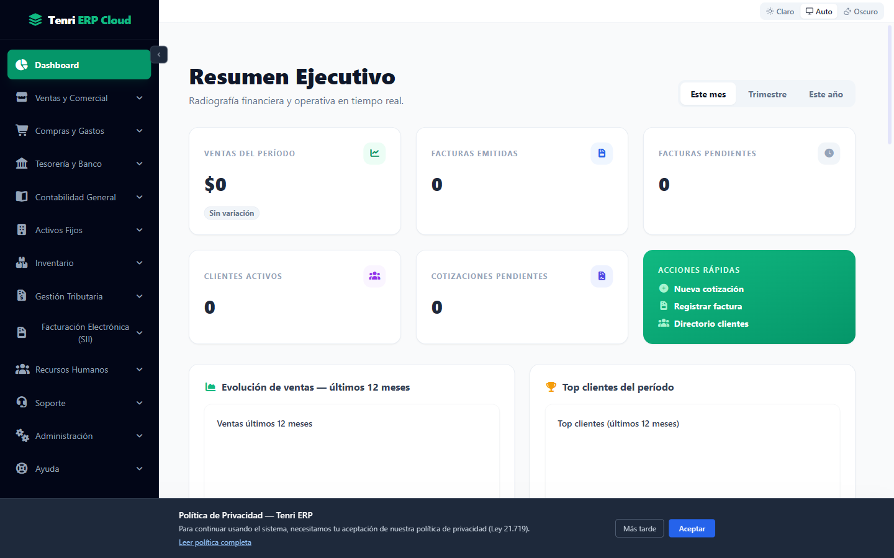
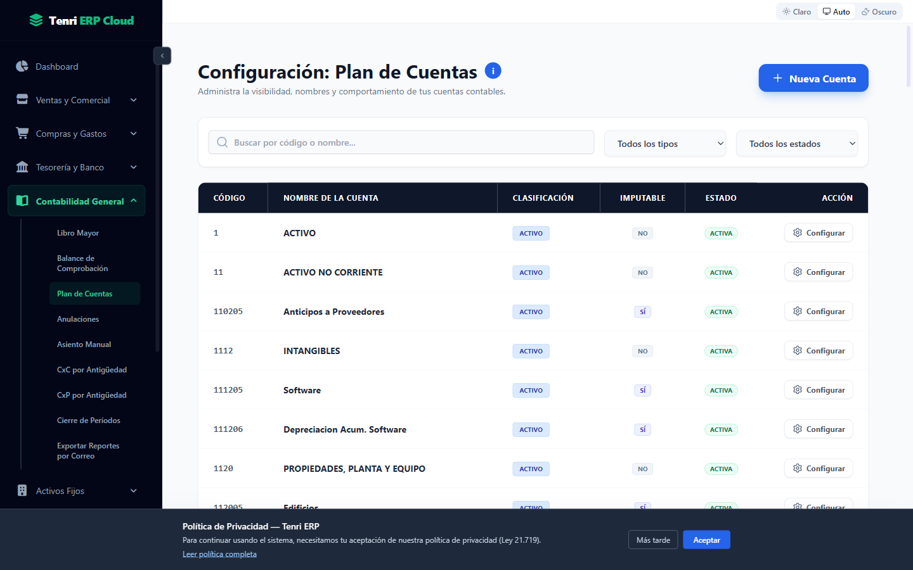
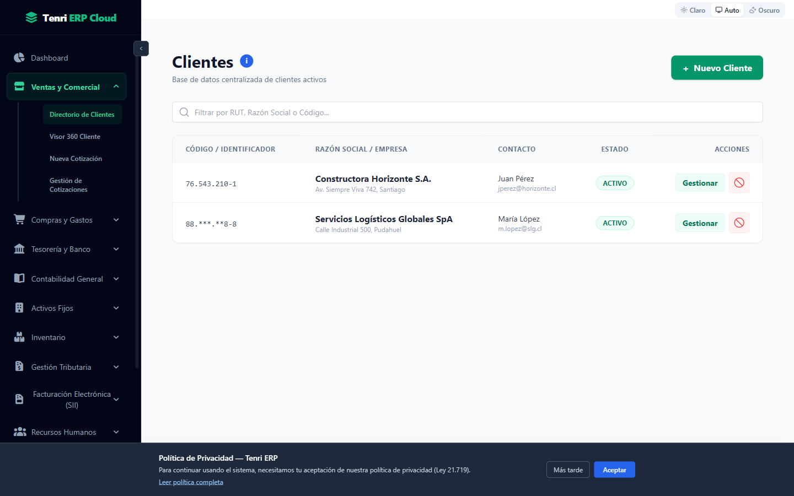
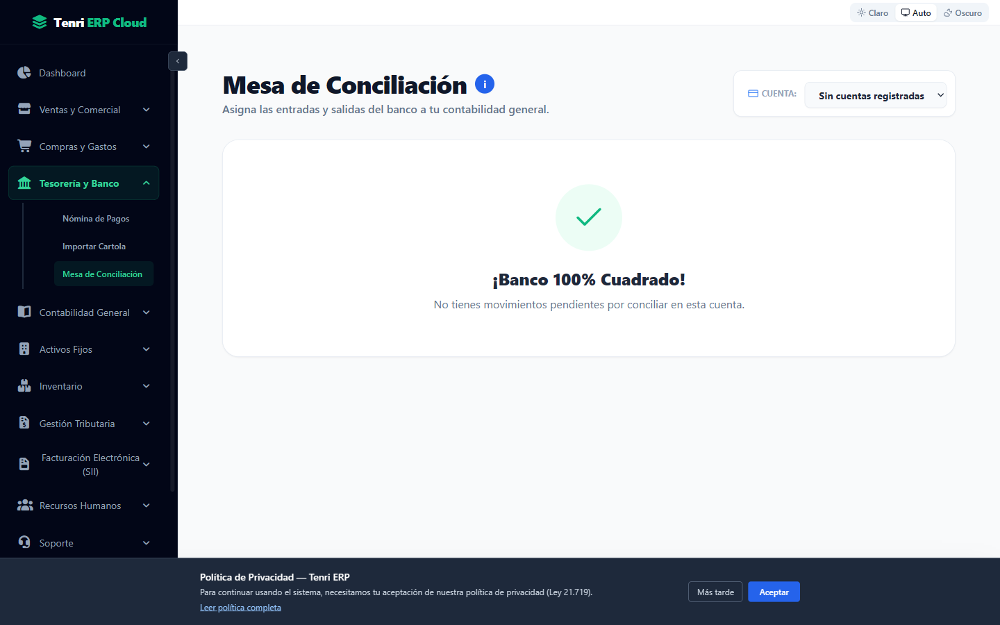
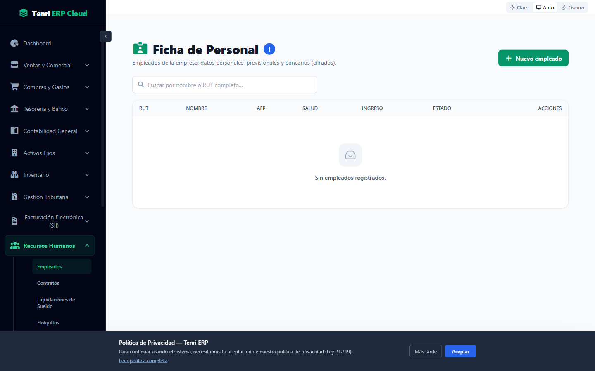

# 📊 Tenri ERP Cloud

Sistema de Planificación de Recursos Empresariales (ERP) diseñado para escalar y automatizar la gestión financiera, contable, tributaria y de remuneraciones de las pymes en Chile.


-777BB4)


## 📸 Vistas del Sistema

<table>
<tr>
<td><br/><sub>Dashboard</sub></td>
<td><br/><sub>Contabilidad — Plan de Cuentas</sub></td>
</tr>
<tr>
<td><br/><sub>Comercial — Clientes</sub></td>
<td><br/><sub>Tesorería — Conciliación</sub></td>
</tr>
<tr>
<td><br/><sub>RRHH — Empleados</sub></td>
<td></td>
</tr>
</table>

## 🏢 Arquitectura del Proyecto

Monorepo (pnpm workspace) con una SPA en React y una API RESTful en Laravel 12.

```text
/ (Raíz del Proyecto)
├── .github/workflows/        # CI/CD (ci-cd.yml: tests + deploy, e2e.yml: Playwright)
├── Backend-laravel/           # API RESTful Laravel 12
│   ├── app/
│   │   ├── Domains/           # Código organizado por dominio de negocio
│   │   │   ├── Core/          # Auth, usuarios, roles, empresas, suscripciones
│   │   │   ├── Contabilidad/  # Plan de cuentas, asientos, períodos, reportes
│   │   │   ├── Comercial/     # Clientes, proveedores, facturas, cotizaciones
│   │   │   ├── Tesoreria/     # Bancos, conciliación, pagos
│   │   │   ├── Rrhh/          # Empleados, contratos, liquidaciones, Previred
│   │   │   ├── Inventario/    # Productos, bodegas, kardex, picking/packing
│   │   │   ├── Sii/           # Integración Servicio de Impuestos Internos
│   │   │   ├── Activos/       # Activos fijos y depreciación
│   │   │   └── CorreccionMonetaria/
│   │   ├── Http/Middleware/   # RBAC, suscripciones, API key HMAC
│   │   └── Support/           # Utilidades transversales (firma HMAC, etc.)
│   ├── routes/api.php         # Todas las rutas de la API
│   ├── tests/                 # PHPUnit (Unit + Feature)
│   └── phpunit.xml            # Tests contra SQLite en memoria por defecto
├── Frontend/                  # Aplicación Web React 19
│   ├── src/
│   │   ├── Modulos/           # Vistas por módulo de negocio
│   │   ├── Contextos/         # AuthContext, Permisos (RBAC)
│   │   ├── Configuracion/     # Cliente axios central, logger
│   │   ├── Componentes/       # Componentes compartidos
│   │   └── Utilidades/        # Helpers (export Excel/PDF)
│   ├── e2e/                   # Tests E2E Playwright
│   └── vite.config.js
└── docs/                      # Normativa SII, leyes RRHH, auditorías
```

## 🚀 Módulos Principales

* **Seguridad (RBAC):** Control de Acceso Basado en Roles con permisos granulares por endpoint. Los menús y componentes de la UI reaccionan a la matriz de permisos.
* **Multitenancy:** Aislamiento de datos por empresa (`empresa_id`) mediante global scope de Eloquent.
* **Finanzas y Tesorería:** Importación de cartolas bancarias, conciliación inteligente, pagos masivos y gestión de anticipos.
* **Contabilidad Avanzada:** Generación automática de asientos, Libro Mayor, Libro Diario, mantenedor de Plan de Cuentas y bloqueo de períodos.
* **RRHH y Remuneraciones:** Contratos, liquidaciones de sueldo, finiquitos, parámetros previsionales (AFP, salud, CCAF), archivo Previred y centralización contable.
* **Inventario:** Multi-bodega, kardex valorizado, lotes, reservas, picking/packing y tomas físicas.
* **Activos Fijos:** Cálculo automatizado de depreciación mensual.
* **Cumplimiento Tributario:** Formulario 29 (F29), F22, Declaraciones Juradas SII (1887, 1879, 1947, 1926, 1837, 1835) y pre-cálculo para la Operación Renta.
* **Suscripciones:** SSO e integración con tenri.cl; gating de funcionalidades por plan y estado de suscripción.
* **Motor de Alertas:** Vigilancia automática de vencimientos y cumplimiento (certificados digitales SII, F29/DJ sin presentar, períodos contables sin cerrar, cuentas por cobrar/pagar vencidas, contratos RRHH por vencer) vía jobs en cola con lock atómico anti-duplicado y notificación por correo.

## 🛠️ Entorno de Desarrollo (Local)

### Prerrequisitos
* PHP 8.2 o superior + Composer
* Node.js 22 o superior + pnpm 11
* MySQL 8.0 (opcional en local: los tests usan SQLite)

### Backend
```bash
cd Backend-laravel
composer install
cp .env.example .env
php artisan key:generate
php artisan migrate
php artisan serve          # API en http://localhost:8000
# o todo junto (serve + queue + logs + vite):
composer dev
```

### Frontend
```bash
cd Frontend
pnpm install
pnpm dev                   # Vite dev server
```

### Tests
```bash
# Backend (SQLite en memoria, ~12s)
cd Backend-laravel && php artisan test

# Frontend
cd Frontend && pnpm lint && pnpm test    # ESLint + Vitest
pnpm e2e                                  # Playwright (requiere pnpm e2e:install)
```

## 🔄 Integración y Despliegue Continuo (CI/CD)

Pipeline automatizado vía GitHub Actions:

* **`ci-cd.yml`** — push a cualquier rama: suite PHPUnit contra SQLite **y** contra MySQL 8 en contenedor (los tests deben pasar en ambos engines), más lint y build del frontend.
  * **Push a `staging`:** si todos los tests pasan, despliega a `staging.erp.tenri.cl` (FTP + SSH, secrets independientes), luego corre smoke tests Playwright contra ese ambiente.
  * **Push a `main`:** si todos los tests pasan, compila el frontend y despliega ambos ecosistemas a producción (FTP + SSH con migraciones y cache de Laravel).
* **`e2e.yml`** — suite E2E Playwright completa (no solo smoke) contra el entorno que corresponda.

## Flujo de despliegue

```
feature/* → PR → staging → validación manual → PR → main → deploy producción
```

* Push a `staging` → deploy automático a `staging.erp.tenri.cl` (environment `staging` en GitHub).
* Staging validado → merge a `main` → deploy a producción (environment `production` en GitHub, requiere aprobación de reviewer).

> **Configuración requerida en GitHub → Settings → Environments:**
> - `staging`: agregar los secrets `FTP_SERVER_STAGING`, `FTP_USERNAME_STAGING`, `FTP_PASSWORD_STAGING`, `SSH_HOST_STAGING`, `SSH_USERNAME_STAGING`, `SSH_PRIVATE_KEY_STAGING`.
> - `production`: agregar una "environment protection rule" con al menos 1 required reviewer antes de hacer deploy a producción.
