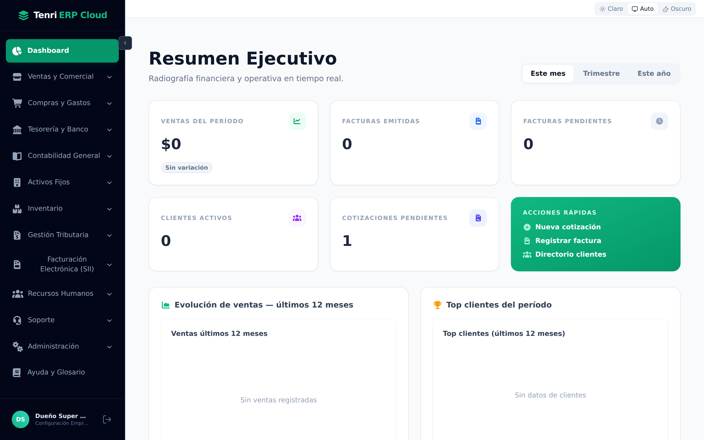
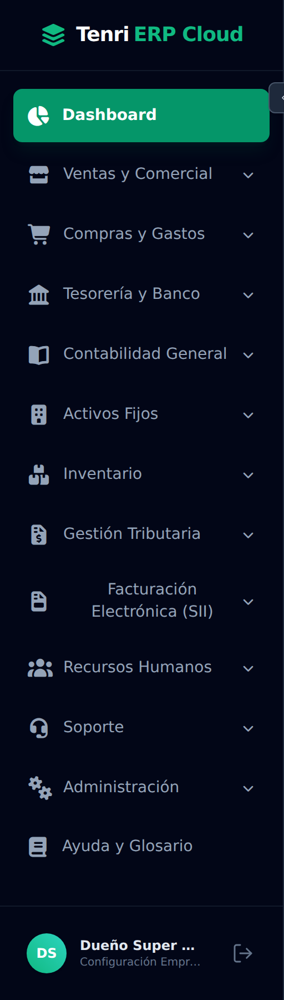
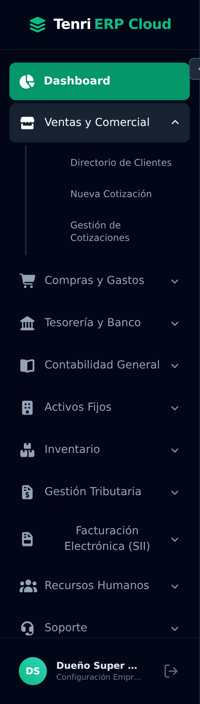
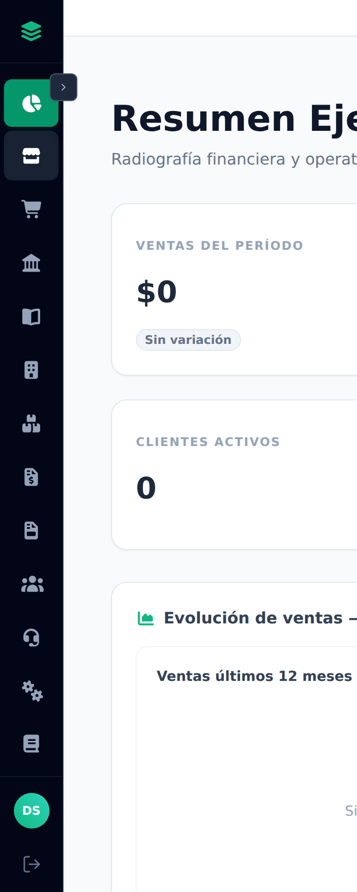
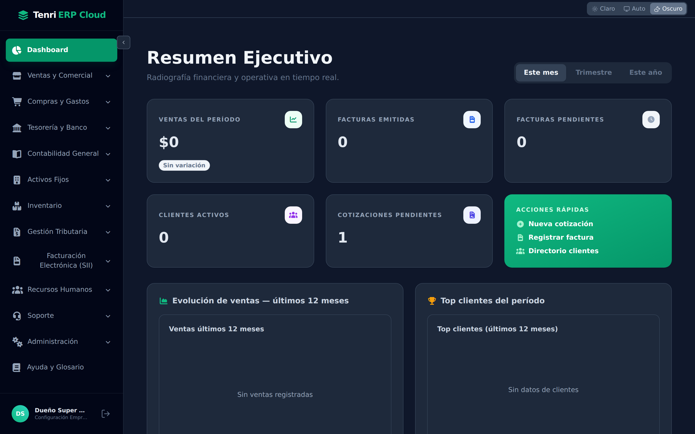
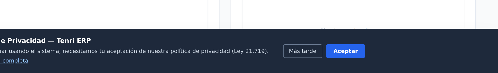
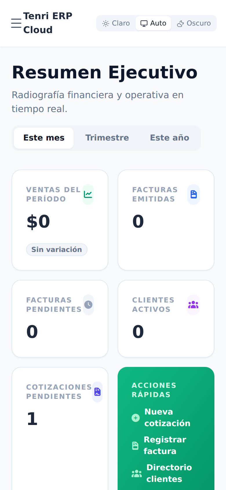
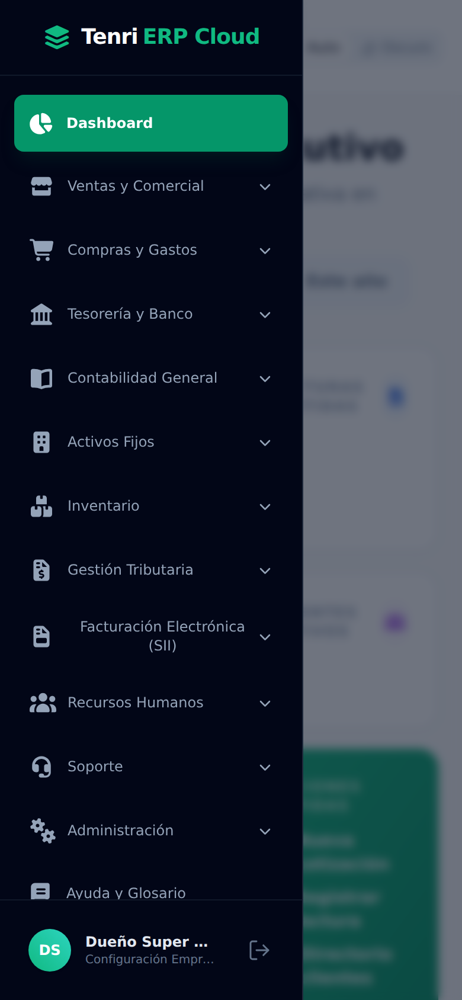

# Manual de Usuario — Tenri ERP Cloud
## 01 · El escritorio: layout y barra lateral

> Este primer manual explica **cómo está organizada la pantalla** de Tenri ERP Cloud:
> la barra lateral de navegación, la cabecera, el cambio de tema, los avisos del
> sistema y el comportamiento en computador y en celular. Es la base para entender
> todos los módulos que veremos a continuación.

---

### 1. Ingreso al sistema

1. Abra su navegador e ingrese a la dirección de Tenri ERP Cloud.
2. Escriba su **correo** y **contraseña** y presione **Iniciar sesión**.
3. Al ingresar, el sistema muestra el **Escritorio (Resumen Ejecutivo)**.

---

### 2. Visión general del escritorio

Una vez dentro, la pantalla se divide en tres zonas:

- **A · Barra lateral (izquierda, azul oscuro):** el menú principal. Desde aquí se
  accede a todos los módulos del sistema.
- **B · Cabecera (arriba a la derecha):** el **selector de tema** (Claro · Auto · Oscuro).
- **C · Área de trabajo (centro):** el contenido del módulo seleccionado. Al ingresar
  muestra el **Resumen Ejecutivo** con los indicadores del negocio.

El **identificador “Tenri ERP Cloud”** aparece siempre en la esquina superior
izquierda, sobre la barra lateral.

---

### 3. La barra lateral, módulo por módulo

La barra lateral agrupa el sistema en bloques de trabajo. De arriba hacia abajo:

| Ícono | Módulo | Para qué sirve |
|---|---|---|
| 📊 | **Dashboard** | Resumen ejecutivo: ventas, facturas, clientes, cotizaciones. |
| 🏬 | **Ventas y Comercial** | Clientes y cotizaciones. |
| 🛒 | **Compras y Gastos** | Proveedores, facturas de compra, honorarios. |
| 🏛️ | **Tesorería y Banco** | Cuentas, cartola, conciliación, nómina de pagos. |
| 📖 | **Contabilidad General** | Plan de cuentas, libro mayor, asientos, cierres. |
| 🏢 | **Activos Fijos** | Registro y depreciación de activos. |
| 📦 | **Inventario** | Bodegas, stock, picking/packing, despachos. |
| 🧾 | **Gestión Tributaria** | F29, Renta, Declaraciones Juradas, Libro CV. |
| 📄 | **Facturación Electrónica (SII)** | Certificado, folios CAF y emisión de DTE. |
| 👥 | **Recursos Humanos** | Empleados, contratos, liquidaciones, LRE, Previred. |
| 🎧 | **Soporte** | Tickets de ayuda. |
| ⚙️ | **Administración** | Usuarios, roles y protección de datos (DPO). |
| 📕 | **Ayuda y Glosario** | Definiciones y ayuda del sistema. |

> El menú que usted ve depende de sus **permisos**: si su rol no tiene acceso a un
> módulo, ese bloque no aparece en la barra lateral.

---

### 4. Abrir y cerrar un grupo del menú

Los bloques con una **flecha (⌄)** a la derecha contienen sub‑opciones. Al hacer clic
sobre el nombre del bloque, este se **despliega** y muestra sus pantallas. Por ejemplo,
**Ventas y Comercial** abre *Directorio de Clientes*, *Nueva Cotización* y *Gestión de
Cotizaciones*:

Para cerrarlo, vuelva a hacer clic sobre el nombre del bloque.

---

### 5. Contraer la barra lateral

Para ganar espacio de trabajo, use el botón **‹** ubicado junto a *Dashboard*. La barra
se contrae y deja solo los **íconos**. Pase el cursor sobre cualquier ícono para
identificar el módulo; presione **›** para volver a expandirla.

---

### 6. Cambiar el tema (claro / oscuro)

En la esquina superior derecha está el **selector de tema** con tres opciones:

- **Claro** — fondo blanco (predeterminado).
- **Auto** — sigue la preferencia del sistema operativo.
- **Oscuro** — fondo oscuro, ideal para ambientes con poca luz.

Así se ve Tenri ERP Cloud en **modo oscuro**:

La preferencia queda guardada en su navegador para las próximas sesiones.

---

### 7. Aviso de Política de Privacidad

La primera vez que ingresa, aparece en la parte inferior un **aviso de Política de
Privacidad** (Ley 21.719):

- **Aceptar** — registra su consentimiento y oculta el aviso.
- **Más tarde** — lo oculta por esta sesión; volverá a mostrarse en el próximo ingreso.
- **Leer política completa** — abre el texto completo.

> Es un aviso **no bloqueante**: puede seguir trabajando aunque no lo acepte de
> inmediato.

---

### 8. Su usuario y cierre de sesión

Al pie de la barra lateral se muestra una tarjeta con **su nombre** y un acceso a la
**configuración de la empresa**, junto al botón **Cerrar sesión** (ícono de salida →).
Use ese botón para salir de forma segura.

---

### 9. Uso en celular

En pantallas pequeñas la barra lateral se **oculta** para aprovechar el espacio. La
cabecera muestra el botón de menú (**☰**) a la izquierda y el selector de tema a la
derecha:

| Vista de celular (menú cerrado) | Menú desplegado |
|---|---|
|  |  |

Toque **☰** para abrir el menú; toque fuera de él o seleccione una opción para cerrarlo.
Las tarjetas y tablas se reorganizan automáticamente para verse bien en el celular.

---

### Resumen

- La **barra lateral** es el centro de navegación y agrupa el sistema por áreas de
  negocio.
- Puede **desplegar/contraer** grupos y **contraer** toda la barra para ganar espacio.
- El **tema** (claro/oscuro/auto) se ajusta desde la cabecera y se recuerda.
- El sistema es **responsivo**: en celular el menú se convierte en un cajón lateral.

> **Siguiente manual:** *02 · Dashboard (Resumen Ejecutivo)* — cómo leer los indicadores
> del negocio y usar las acciones rápidas.
